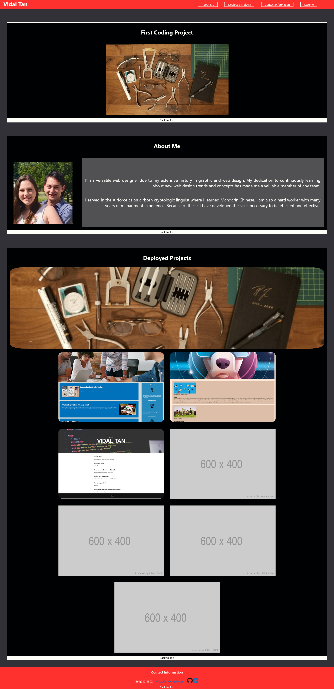

# Portfolio

## What is it?

This is my personal portfolio meant to showcase all my deployed/active projects.
I will be updating this as I progress through the class. This is currently live.

## Purpose 

Showcase my work to employers and allow for a single point of refrence for my
understanding of web-development

## Finished Product

Link to [Portfolio](https://vidalatan.github.io/Mini-project/)
Link to [Code Repository](https://github.com/Vidalatan/Mini-project)
